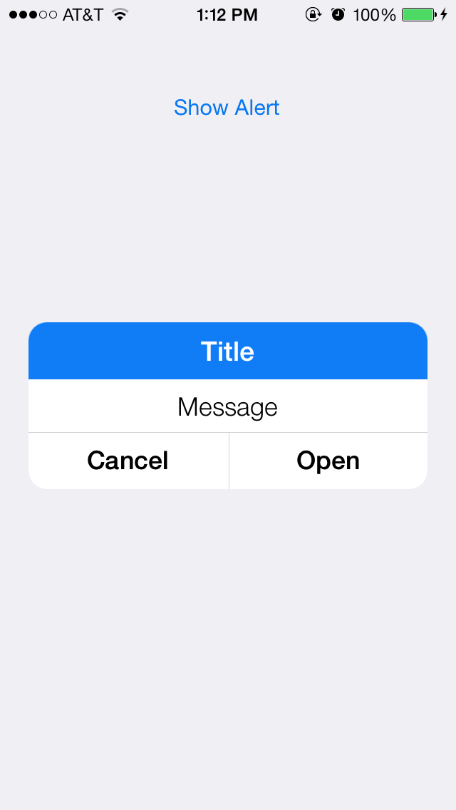
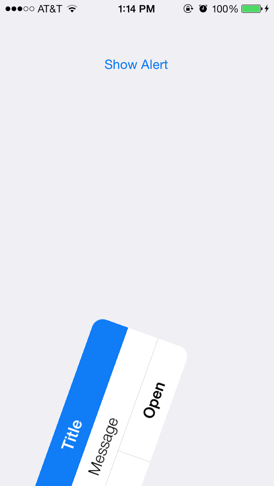

## TweetbotAlertView

Tweetbot 3 alert view style and animation




Video of alert: http://cl.ly/S9hY

###Usage

######Objective-C
```
TweetbotAlertController *alertController = [[TweetbotAlertController alloc] initWithTitle:@"Title" message:@"Message" preferredStyle:UIAlertControllerStyleAlert];

TweetbotAlertAction *action = [[TweetbotAlertAction alloc] initWithTitle:@"Cancel" style:TweetbotAlertActionStyleCancel handler:^(TweetbotAlertAction * _Nonnull action) {
    NSLog(@"Tapped cancel action");
}];
[alertController addAction:action];

TweetbotAlertAction *action2 = [[TweetbotAlertAction alloc] initWithTitle:@"Default" style:TweetbotAlertActionStyleDefault handler:^(TweetbotAlertAction * _Nonnull action) {
    NSLog(@"Tapped default action");
}];
[alertController addAction:action2];

[self presentViewController:alertController animated:NO completion:nil];
```

######Swift
```
let alertController = TweetbotAlertController(title: "Title", message: "Message", preferredStyle: .Alert)
        
let cancelAction = TweetbotAlertAction(title: "Cancel", style: .Cancel) { (action) in
    ...
}
alertController.addAction(cancelAction)

let defaultAction = TweetbotAlertAction(title: "Default", style: .Default) { (action) in
    ...
}
alertController.addAction(defaultAction)

self.presentViewController(alertController, animated: false, completion: nil)
```

It is important to have `animated:` set to `false` so it animates correctly, although I am hoping to change the way it is presented to use a custom transition coordinator so this won't be an issue.

## License

<pre>
The MIT License (MIT)

Copyright (c) 2016 Maximilian Litteral

Permission is hereby granted, free of charge, to any person obtaining a copy
of this software and associated documentation files (the "Software"), to deal
in the Software without restriction, including without limitation the rights
to use, copy, modify, merge, publish, distribute, sublicense, and/or sell
copies of the Software, and to permit persons to whom the Software is
furnished to do so, subject to the following conditions:

The above copyright notice and this permission notice shall be included in
all copies or substantial portions of the Software.

THE SOFTWARE IS PROVIDED "AS IS", WITHOUT WARRANTY OF ANY KIND, EXPRESS OR
IMPLIED, INCLUDING BUT NOT LIMITED TO THE WARRANTIES OF MERCHANTABILITY,
FITNESS FOR A PARTICULAR PURPOSE AND NONINFRINGEMENT. IN NO EVENT SHALL THE
AUTHORS OR COPYRIGHT HOLDERS BE LIABLE FOR ANY CLAIM, DAMAGES OR OTHER
LIABILITY, WHETHER IN AN ACTION OF CONTRACT, TORT OR OTHERWISE, ARISING FROM,
OUT OF OR IN CONNECTION WITH THE SOFTWARE OR THE USE OR OTHER DEALINGS IN
THE SOFTWARE.
</pre>
